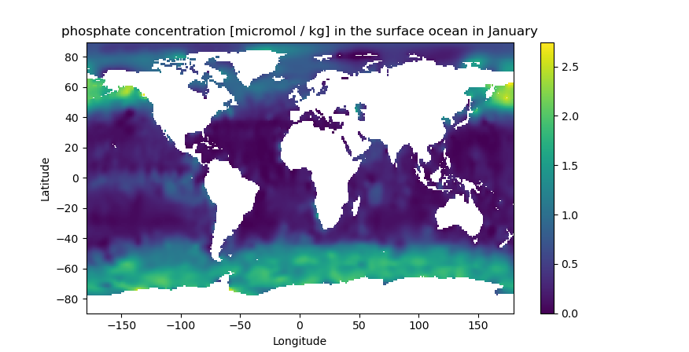

### This is a tiny module to read World Ocean Atlas 2018 monthly climatology

[WOA18](https://www.ncei.noaa.gov/products/world-ocean-atlas)

### Installlation 
```shell
git clone https://github.com/saeeron/WOA18reader
```

### Dependencies

[xarray](http://xarray.pydata.org/en/stable/)
[NumPy](https://numpy.org/)

### Example: 
```python
from WOA18reader import WOA18reader

ds, LON,LAT, DEPTH, M3d  = WOA18reader("Phosphate") 
 
 # ds is a numpy array of phosphate data with shape (180, 360, 102, 12), 
 # which are latitude, longitude, depth levels and months   
 # LON is longitude 
 # LAT is latitude 
 # DEPTH is depth
 # M3d is a mask (ocean = 1, land = 0)

```

### Plotting the results  

```python
import matplotlib.pyplot as plt 

plt.pcolor(LON[:,:,0], LAT[:,:,0], ds[:,:,0,0])
plt.title("phosphate concentration [micromol / kg] in the surface ocean in January")
plt.xlabel("Longitude")
plt.ylabel("Latitude")
plt.colorbar()
plt.show()

```

<p align="center"></p>
